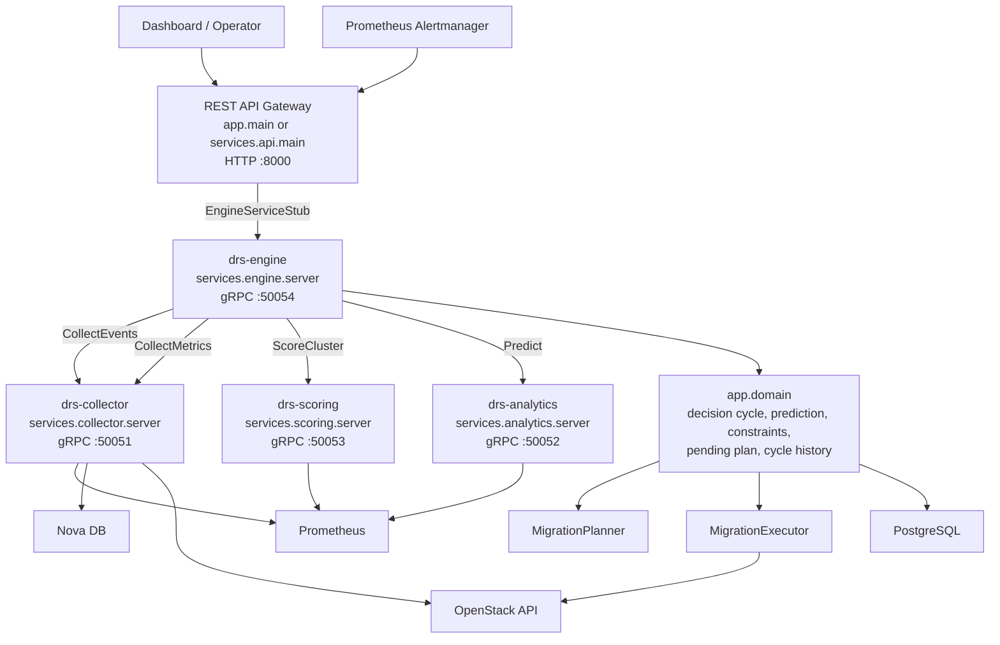

# OpenStackDRS

OpenStackDRS is a Distributed Resource Scheduler for OpenStack. The system collects host and VM metrics, evaluates current and predicted cluster imbalance, builds migration plans, and optionally executes OpenStack live migrations.

The current architecture is split into:

- A REST API gateway for dashboard/operator access.
- gRPC runtime services for collector, analytics, scoring, and engine.
- Shared domain modules under `app/domain`.
- Generated protobuf clients/stubs under `app/grpc`.

## Architecture Overview



## Basic Runtime Flow

1. Dashboard/operator calls the REST API, or Alertmanager sends a webhook.
2. REST API uses `app.clients.rpc_clients.engine_client()` to call `drs-engine` through gRPC.
3. `drs-engine` runs `app.domain.engine_cycle.run_decision_cycle()`.
4. Engine asks `drs-collector` to check recent VM events and collect fresh metrics.
5. Engine asks `drs-scoring` to compute current cluster imbalance.
6. If current imbalance is below threshold, engine asks `drs-analytics` for prediction.
7. If current or predicted imbalance exceeds threshold, engine builds a migration plan.
8. If `APPROVAL_MODE=manual`, the plan is stored as pending and must be approved through REST API.
9. If `APPROVAL_MODE=auto`, engine executes selected migrations through OpenStack.
10. Cycle results are recorded into PostgreSQL cycle history.

## Project Structure

```text
OpenstackDRS/
├── app/
│   ├── api/                    # FastAPI routers exposed by the REST API gateway
│   │   ├── monitor.py           # Latest decision endpoint
│   │   ├── plan.py              # Pending plan approve/reject endpoints
│   │   ├── webhook.py           # Alertmanager webhook endpoint
│   │   ├── constraints.py       # Constraint CRUD endpoints
│   │   ├── cycle_history.py     # Decision cycle history endpoint
│   │   ├── configuration.py     # Runtime config and scheduler control endpoints
│   │   └── inventory.py         # Inventory test/debug endpoint
│   ├── clients/                # Client adapters to external/internal services
│   │   └── rpc_clients.py       # gRPC client helper for EngineService
│   ├── collector/              # Prometheus and OpenStack/Nova event collectors
│   ├── core/                   # Settings and constants
│   ├── db/                     # PostgreSQL initialization and connection helpers
│   ├── decision/               # Placement constraints, datasources, migration planner
│   ├── domain/                 # Shared business logic
│   ├── executor/               # OpenStack migration execution
│   ├── grpc/                   # Generated protobuf Python files
│   ├── models/                 # Pydantic schemas
│   ├── scheduler/              # API-side scheduler control helpers
│   ├── scoring/                # Imbalance scoring functions
│   ├── utils/                  # Logging utilities
│   └── main.py                 # Local REST API entrypoint
├── services/
│   ├── api/                    # Docker/runtime REST API entrypoint
│   ├── collector/              # gRPC collector runtime
│   ├── analytics/              # gRPC analytics/runtime prediction service
│   ├── scoring/                # gRPC scoring runtime
│   └── engine/                 # gRPC engine runtime
├── protos/                     # Protobuf service definitions
├── scripts/
│   └── gen_protos.sh           # Generate app/grpc/*_pb2.py stubs
├── dashboard/                  # Next.js dashboard
├── docker-compose.yml
└── requirements.txt
```

## Component Responsibilities

| Component | Runtime | Responsibility |
|---|---:|---|
| REST API Gateway | HTTP `:8000` | Public API for dashboard/operators. Delegates decision and plan operations to engine gRPC. |
| `drs-engine` | gRPC `:50054` | Orchestrates DRS cycle, coordinates collector/scoring/analytics, builds/stores/executes plans. |
| `drs-collector` | gRPC `:50051` | Collects Prometheus metrics and checks recent OpenStack/Nova VM events. |
| `drs-analytics` | gRPC `:50052` | Builds Chronos inputs and predicts next-window host metrics. |
| `drs-scoring` | gRPC `:50053` | Computes cluster/host imbalance scores. |
| PostgreSQL | `:5432` | Stores constraints and cycle history. |
| Dashboard | HTTP `:3000` | Operator UI. |