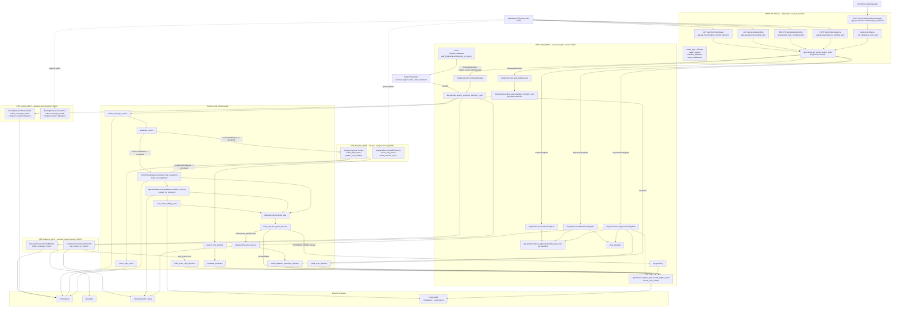

# OpenStack DRS gRPC Flow

```mermaid
flowchart TD
    %% Entry points
    USER[Dashboard / Operator / API Client]
    ALERT[Prometheus Alertmanager]
    ENGINE_TIMER[Engine Scheduler<br/>services.engine.server._start_scheduler]

    %% REST API process
    subgraph API[REST API Process - app.main / services.api.main]
        APP_START[create_app + lifespan<br/>setup_logging<br/>initialize_database<br/>setup_middleware]
        MONITOR_API[GET /api/v1/monitor/latest<br/>app.api.monitor.latest_monitor_decision]
        PLAN_PENDING_API[GET /api/v1/plan/pending<br/>app.api.plan.get_pending_plan]
        PLAN_REJECT_API[DELETE /api/v1/plan/pending<br/>app.api.plan.reject_pending_plan]
        PLAN_APPROVE_API[POST /api/v1/plan/approve<br/>app.api.plan.approve_pending_plan]
        WEBHOOK_API[POST /api/v1/webhook/alertmanager<br/>app.api.webhook.alertmanager_webhook]
        WEBHOOK_BG[BackgroundTasks<br/>_run_rebalance_from_alert]
        API_ENGINE_CLIENT[app.clients.rpc_clients.engine_client<br/>EngineServiceStub]
    end

    %% Engine gRPC service
    subgraph ENGINE[DRS Engine gRPC - services.engine.server :50054]
        ENGINE_SERVE[serve<br/>initialize_database<br/>add_EngineServiceServicer_to_server]
        ENGINE_RPC_COMPUTE[EngineServicer.ComputeDecision]
        ENGINE_RPC_LATEST[EngineServicer.GetLatestDecision]
        ENGINE_RPC_PENDING[EngineServicer.GetPendingPlan]
        ENGINE_RPC_REJECT[EngineServicer.RejectPendingPlan]
        ENGINE_RPC_APPROVE[EngineServicer.ApprovePendingPlan]
        ENGINE_CYCLE[app.domain.engine_cycle.run_decision_cycle]
        ENGINE_SAFE_RECORD[app.domain.engine_cycle.record_engine_cycle<br/>record_cycle_history]
        LATEST_DECISION[app.domain.engine_approval.latest_decision_json<br/>get_latest_decision]
        PENDING_GET[app.domain.engine_approval.pending_plan_json<br/>get_pending]
        PENDING_SET[set_pending]
        PENDING_CLEAR[clear_pending]
    end

    %% gRPC backend services
    subgraph COLLECTOR[DRS Collector gRPC - services.collector.server :50051]
        COLLECT_EVENTS[CollectorServicer.CollectEvents<br/>has_recent_vm_events]
        COLLECT_METRICS[CollectorServicer.CollectMetrics<br/>collect_averages_metric]
    end

    subgraph SCORING[DRS Scoring gRPC - services.scoring.server :50053]
        SCORE_CLUSTER[ScoringServicer.ScoreCluster<br/>collect_averages_metric<br/>compute_cluster_imbalance]
        SCORE_HOST[ScoringServicer.ScoreHost<br/>collect_averages_metric<br/>compute_cluster_imbalance]
    end

    subgraph ANALYTICS[DRS Analytics gRPC - services.analytics.server :50052]
        PREDICT[AnalyticsServicer.Predict<br/>collect_fully_metric<br/>predict_next_window]
        BUILD_FEATURES[AnalyticsServicer.BuildFeatures<br/>collect_fully_metric<br/>build_chronos_input]
    end

    %% Local engine domain calls
    subgraph DOMAIN[Engine Local Domain Logic]
        LOCAL_5M[collect_averages_metric]
        EVAL_CURRENT[evaluate_current]
        LOCAL_30M[collect_fully_metric]
        PREDICT_LOCAL[predict_next_window]
        EVAL_PRED[evaluate_predicted]
        PROM_DS[PrometheusDatasource.build_host_snapshots<br/>build_vm_snapshots]
        OS_INV[OpenStackInventoryDatasource.build_inventory<br/>extract_vm_inventory]
        CONSTRAINTS[load_active_affinity_rules]
        PLANNER[MigrationPlanner.build_plan]
        PLAN_DECISION[build_migration_plan_decision]
        EXECUTOR[MigrationExecutor.execute]
        EXEC_DECISION[build_migration_execution_decision]
        ERROR_DECISION[build_error_decision]
        EVENT_SKIP[build_event_skip_decision]
    end

    %% External systems
    subgraph EXTERNAL[External Systems]
        PROM[Prometheus]
        NOVA_DB[Nova DB]
        OPENSTACK[OpenStack API / Nova]
        POSTGRES[PostgreSQL<br/>constraints + cycle history]
    end

    %% REST entry routing
    USER --> MONITOR_API
    USER --> PLAN_PENDING_API
    USER --> PLAN_REJECT_API
    USER --> PLAN_APPROVE_API
    ALERT --> WEBHOOK_API
    WEBHOOK_API --> WEBHOOK_BG

    MONITOR_API --> API_ENGINE_CLIENT
    PLAN_PENDING_API --> API_ENGINE_CLIENT
    PLAN_REJECT_API --> API_ENGINE_CLIENT
    PLAN_APPROVE_API --> API_ENGINE_CLIENT
    WEBHOOK_BG --> API_ENGINE_CLIENT

    API_ENGINE_CLIENT -- GetLatestDecision --> ENGINE_RPC_LATEST
    API_ENGINE_CLIENT -- GetPendingPlan --> ENGINE_RPC_PENDING
    API_ENGINE_CLIENT -- RejectPendingPlan --> ENGINE_RPC_REJECT
    API_ENGINE_CLIENT -- ApprovePendingPlan --> ENGINE_RPC_APPROVE
    API_ENGINE_CLIENT -- ComputeDecision trigger_source=alertmanager --> ENGINE_RPC_COMPUTE

    %% Engine scheduler path
    ENGINE_SERVE --> ENGINE_TIMER
    ENGINE_TIMER -- periodic --> ENGINE_CYCLE
    ENGINE_RPC_COMPUTE --> ENGINE_CYCLE

    %% Engine read/write RPCs
    ENGINE_RPC_LATEST --> LATEST_DECISION
    ENGINE_RPC_PENDING --> PENDING_GET
    ENGINE_RPC_REJECT --> PENDING_GET
    ENGINE_RPC_REJECT --> PENDING_CLEAR
    ENGINE_RPC_APPROVE --> PENDING_GET
    ENGINE_RPC_APPROVE --> EXECUTOR
    ENGINE_RPC_APPROVE --> EXEC_DECISION
    ENGINE_RPC_APPROVE --> PENDING_CLEAR
    ENGINE_RPC_APPROVE --> ENGINE_SAFE_RECORD

    %% Decision cycle: gRPC service calls
    ENGINE_CYCLE --> COLLECT_EVENTS
    COLLECT_EVENTS --> NOVA_DB
    COLLECT_EVENTS --> OPENSTACK
    ENGINE_CYCLE --> COLLECT_METRICS
    COLLECT_METRICS --> PROM
    ENGINE_CYCLE --> SCORE_CLUSTER
    SCORE_CLUSTER --> PROM
    ENGINE_CYCLE --> LOCAL_5M
    LOCAL_5M --> PROM
    LOCAL_5M --> EVAL_CURRENT

    %% Event guard and scoring branches
    COLLECT_EVENTS -- has_events=true --> EVENT_SKIP
    EVENT_SKIP --> ENGINE_SAFE_RECORD
    EVAL_CURRENT -- current imbalance <= threshold --> PREDICT
    PREDICT --> LOCAL_30M
    PREDICT --> PREDICT_LOCAL
    LOCAL_30M --> PROM
    PREDICT_LOCAL --> EVAL_PRED
    EVAL_PRED --> ENGINE_SAFE_RECORD

    %% Rebalance planning branch
    EVAL_CURRENT -- current imbalance > threshold --> PROM_DS
    PREDICT -- predicted imbalance > threshold --> PROM_DS
    PROM_DS --> PROM
    PROM_DS --> OS_INV
    OS_INV --> OPENSTACK
    OS_INV --> CONSTRAINTS
    CONSTRAINTS --> POSTGRES
    CONSTRAINTS --> PLANNER
    OS_INV --> PLANNER
    PROM_DS --> PLANNER
    PLANNER --> PLAN_DECISION

    %% Manual vs auto execution
    PLAN_DECISION -- no candidates --> ENGINE_SAFE_RECORD
    PLAN_DECISION -- APPROVAL_MODE=manual --> PENDING_SET
    PENDING_SET --> ENGINE_SAFE_RECORD
    PLAN_DECISION -- APPROVAL_MODE=auto --> EXECUTOR
    EXECUTOR --> OPENSTACK
    EXECUTOR --> EXEC_DECISION
    EXEC_DECISION --> ENGINE_SAFE_RECORD

    %% Persistence and errors
    ENGINE_SAFE_RECORD --> POSTGRES
    ENGINE_CYCLE -- exception --> ERROR_DECISION
    ERROR_DECISION --> ENGINE_SAFE_RECORD

    %% Optional direct RPCs not used by current REST routes
    USER -. optional gRPC .-> SCORE_HOST
    USER -. optional gRPC .-> BUILD_FEATURES
```
